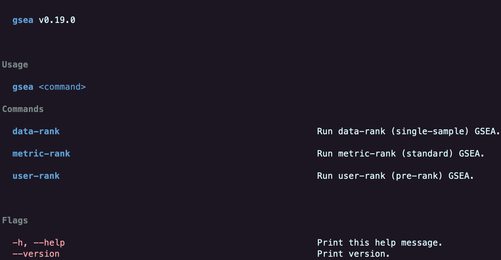

# Gene set enrichment analysis 🏔️

Julia implementation of next-generation Gene Set Enrichment Analysis (GSEA), featuring 200X faster original algorithms and new information-theoretic algorithms for enhanced analysis.

## Julia

```julia
using GSEA

GSEA.metric_rank(
    joinpath(homedir(), "Downloads"),
    joinpath("example", "sarcopenia", "target_x_sample_x_number.tsv"),
    joinpath("example", "sarcopenia", "feature_x_sample_x_number.tsv"),
    joinpath("example", "sarcopenia", "set_features.json");
    number_of_permutations = 10,
    more_sets_to_plot = ["WP_DNA_MISMATCH_REPAIR", "WP_CELL_CYCLE"],
)
```

```julia
GSEA.read_cls(joinpath("data", "a.cls"))

GSEA.read_gct(joinpath("data", "b.gct"))

GSEA.read_gmt(joinpath("data", "c.gmt"))
```

## Command Line Interface



```bash
gsea metric-rank \
    ~/Downloads \
    example/sarcopenia/target_x_sample_x_number.tsv \
    example/sarcopenia/feature_x_sample_x_number.tsv \
    example/sarcopenia/set_features.json \
    --number-of-permutations 10 \
    --more-sets-to-plot "WP_DNA_MISMATCH_REPAIR WP_CELL_CYCLE"
```

```bash
gsea cls ~/Downloads/a.tsv data/a.cls

gsea gct ~/Downloads/b.tsv data/b.gct

gmt ~/Downloads/cd.json data/c.gmt data/d.gmt
```

## Install

We plan to sign this app for macOS soon.
In the meantime, please [enable third-party apps](https://support.apple.com/en-us/102445#openanyway).

Download and extract the latest [release](https://github.com/GSEA-MSigDB/GSEA.jl/releases/latest).

```bash
PATH=$(pwd)/gsea/bin:$PATH
```

## Build

```julia
]build
```

```bash
PATH=~/.julia/bin:$PATH
```

## Contact Us

If you have any questions, issues, or concerns, please feel free to [open a GitHub issue](https://github.com/GSEA-MSigDB/GSEA.jl/issues/new/choose).

---

Made by [Kata](https://github.com/KwatMDPhD/Kata.jl) 🥋
